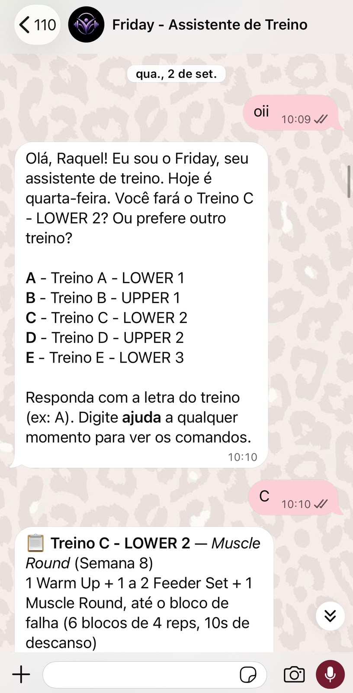
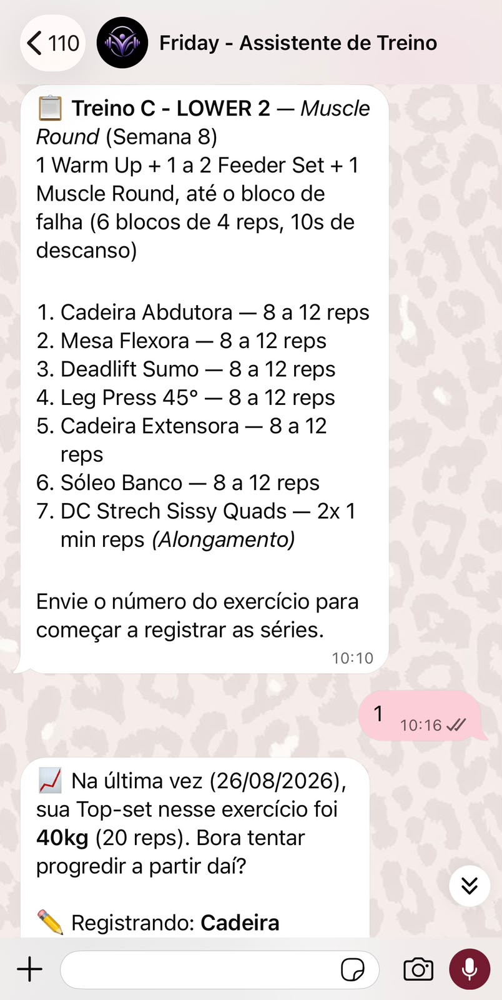
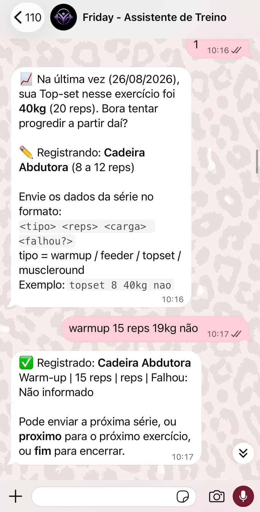

# Bot de Registro de Treino no WhatsApp

Bot que te deixa escolher o treino do dia (A a E, conforme seu protocolo) e registrar cada série — tipo (warm-up/feeder/top-set), repetições, carga e se falhou — direto numa planilha do Google Sheets, organizada por semana, para seu personal acompanhar.

Custo: R$ 0. Usa a API oficial do WhatsApp (Meta), que é gratuita para esse volume de uso, e o Google Sheets, também gratuito.

## Como funciona (visão geral)

```
Você (WhatsApp) → WhatsApp Cloud API → seu servidor (Render, grátis) → Google Sheets
```

Você conversa normalmente com um número de WhatsApp. O servidor recebe a mensagem, interpreta o que você mandou e grava a linha na aba da semana certa na planilha.

## Prints do bot funcionando

<!-- Adicione aqui capturas de tela mostrando o bot em uso -->

| Saudação + escolha do treino | Lista de exercícios | Lembrete de carga + registro da série |
|---|---|---|
|  |  |  |

**Planilha atualizada:**


## Estrutura do projeto

```
bot-treino-whatsapp/
├── src/
│   ├── server.js      # servidor Express + webhook do WhatsApp
│   ├── session.js     # máquina de estados da conversa
│   ├── sheets.js      # leitura/escrita no Google Sheets
│   ├── whatsapp.js    # envio de mensagens
│   ├── workouts.js    # dados dos treinos A-E do seu protocolo
│   └── utils.js       # cálculo da semana atual do programa
├── package.json
└── .env.example
```
